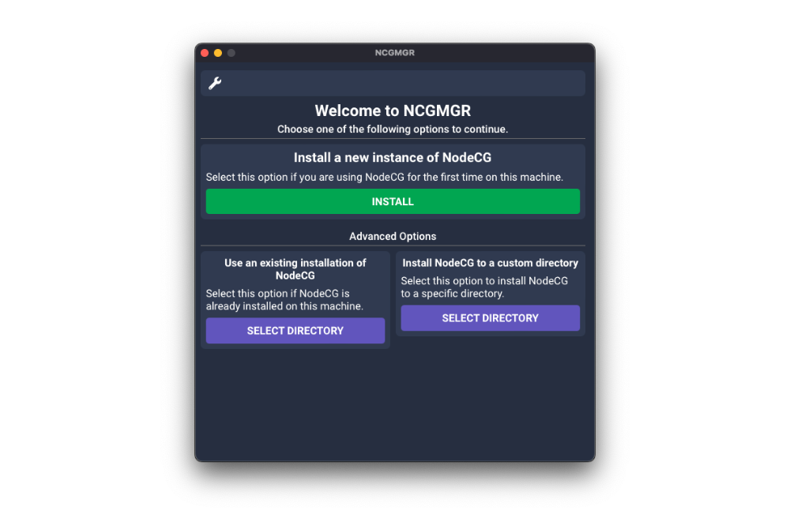
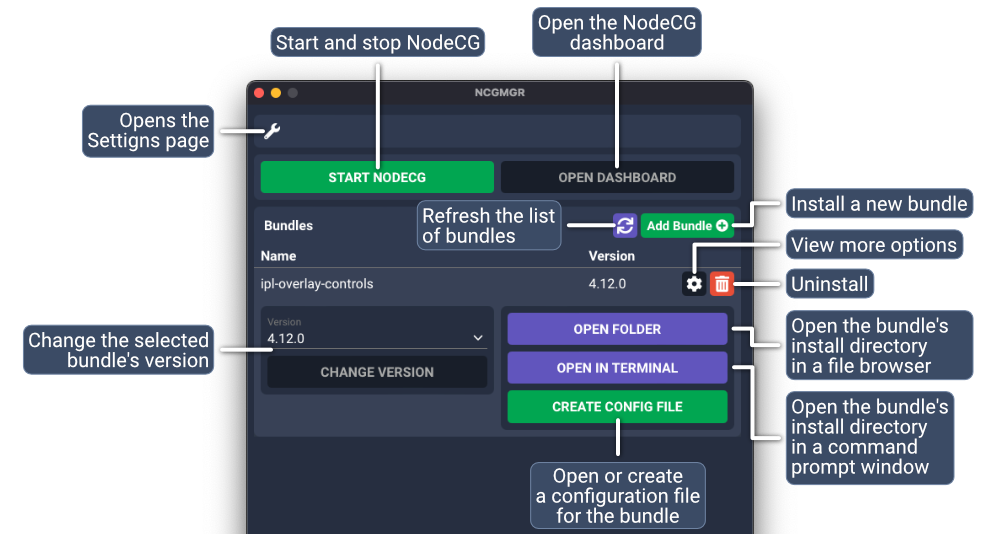
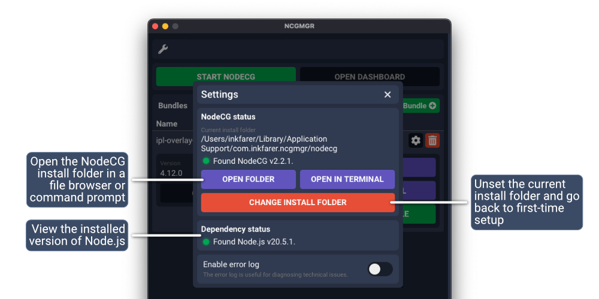

# User's guide

## Installation

### Windows

Visit the [Releases page](https://github.com/IPLSplatoon/NCGMGR/releases) and find the latest version listed at the top
of the page. Under the "Assets" section, download the `.msi` installer file and run it. Follow the prompts to complete the installation process.

### macOS

Visit the [Releases page](https://github.com/IPLSplatoon/NCGMGR/releases) and find the latest version listed at the top
of the page. Under the "Assets" section, download the `.dmg` package and open it. Drag the `NCGMGR` application to the Applications folder.

If you encounter a warning stating that the app "cannot be opened because the developer cannot be verified", close the
prompt by selecting "Cancel", control-click the `NCGMGR.app` file in Finder and select "Open" to open the app anyway.

### Linux

NCGMGR has not been tested on any Linux distributions, and must be [manually built](/development/#building-and-running-ncgmgr) before it can be used.
Issue reports from Linux systems will be accepted, though they may take longer to resolve.

## First start

NCGMGR needs Node.js to be installed to function. It will check for a Node.js installation when it is first started.

When a Node.js installation is not found, an alert will be displayed to the user. To download Node.js, visit its [website.](https://nodejs.dev/)
The LTS version of Node.js is sufficient for the majority of users.

## Installing a new copy of NodeCG

When a Node.js installation is found, NCGMGR can either automatically select a directory and install NodeCG into it, 
install NodeCG into a custom user directory or manage an existing installation of NodeCG.

## Managing bundles and using NodeCG

After NodeCG has been installed, the interface will display options to start and stop NodeCG and manage bundles. 
A *bundle* in NodeCG contains graphics, dashboard panels and Node.js code (Extensions).

### Installing bundles

Bundles can be installed by selecting "Add Bundle" in the main application window and typing one of the following as the
repository path:

- A GitHub username/repository name pair (`inkfarer/ipl-overlay-controls`)
- A git repository URL (`https://github.com/inkfarer/ipl-overlay-controls.git`)

## Settings

Click the settings wrench along the top of the application window to access the settings page.

### NodeCG status

From the settings page, the currently selected NodeCG installation directory can be viewed. 
Select "Change Install Folder" to return to the first-time setup page and select a different NodeCG installation or 
install NodeCG again.

### Dependency status

The settings page displays the detected version of Node.js.

### Error log

The error log, when enabled, displays a list of errors that have occurred while the application is running. It can be 
used to diagnose technical issues with NCGMGR itself.
