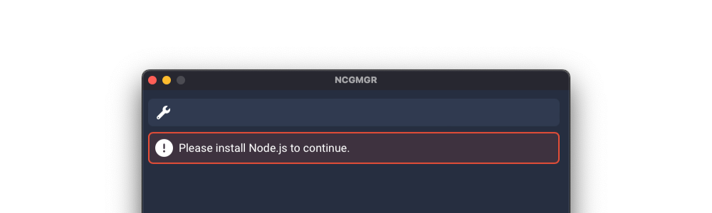

# User's guide

## Installation

### Windows

Visit the [Releases page](https://github.com/IPLSplatoon/NCGMGR/releases) and find the latest version listed at the top
of the page. Under the "Assets" section, download the `.msi` installer file and run it. Follow the prompts to complete the installation process.

### macOS

Visit the [Releases page](https://github.com/IPLSplatoon/NCGMGR/releases) and find the latest version listed at the top
of the page. Under the "Assets" section, download the `.dmg` package and open it. Drag the `NCGMGR` application to the Applications folder.

If you encounter a warning stating that the app "cannot be opened because the developer cannot be verified", close the
prompt by selecting "Cancel", control-click the `NCGMGR.app` file in Finder and select "Open" to open the app anyway.

### Linux

NCGMGR has not been tested on any Linux distributions, and must be [manually built](/development/#building-and-running-ncgmgr) before it can be used.
Issue reports from Linux systems will be accepted, though they may take longer to resolve.

## First start

NCGMGR needs Node.js to be installed to function. It will check for a Node.js installation when it is first started.

When a Node.js installation is not found, an alert will be displayed to the user. To download Node.js, visit its [website.](https://nodejs.dev/)
The LTS version of Node.js is sufficient for the majority of users.

### Installing a new copy of NodeCG

When a Node.js installation is found, you will be prompted to choose a directory to install NodeCG in.
Click "Select folder" and pick a directory. In order to install NodeCG from scratch, select an empty directory.
After selecting a suitable directory, click "Install" to start the installation process.

### Using an existing installation of NodeCG

To use an existing installation of NodeCG, click "Select folder" and select the directory NodeCG was installed in.
NCGMGR will automatically look for a NodeCG installation when a new install directory is selected.

### Starting NodeCG

After setting up a NodeCG installation, click on "Start" to start NodeCG. A log window will appear, showing any messages
that appear while NodeCG is running. While NodeCG is running, click "Open dashboard" to open the NodeCG dashboard in a
web browser. NodeCG may be stopped by clicking on the "Stop" button.

## Managing bundles

A *bundle* in NodeCG contains graphics, dashboard panels and Node.js code (Extensions).

### Installing bundles

Bundles can be installed from the following sources:

- A GitHub username/repository name pair (`inkfarer/ipl-overlay-controls`)
- A git repository URL (`https://github.com/inkfarer/ipl-overlay-controls.git`)
